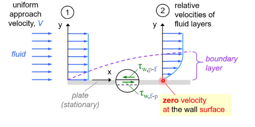

# Chapter-1

[TOC]

## Introduction

### Stress

**Stress** is defined as the force per unit area

#### Normal Stress

$$
\sigma = \frac{\mathrm{d}F_n}{\mathrm{d}A}
$$

> In a fluid at rest, the **normal stress** is called **pressure P**

#### Tangential Stress

$$
\tau = \frac{\mathrm{d}F_t}{\mathrm{d}A}
$$

### Fluid

A substance in the **liquid** or **gas** phase is referred to as a **fluid**

> A fluid **deforms continuously** under the influence of a shear stress, no matter how small and approaches a certain rate of strain

## The No-Slip Condition

### Definition

A fluid in direct contact with a solid "sticks" to the surface due to viscous effects

> The fluid property responsible for the no-slip condition and the development of the boundary layer is **viscosity**

## System and Control Volume

### Definition

A **system** is defined as a quantity of matter or a region in space chosen for study

The mass or region outside the system is called the **surroundings**

The real or imaginary surface that separates the system from its surroundings is called the **boundary**

### Classifications

#### Closed System

a system consists of a fixed amount of mass and no mass can cross its boundary

#### Open System

a system where both mass and energy can cross the boundary of a control volume

