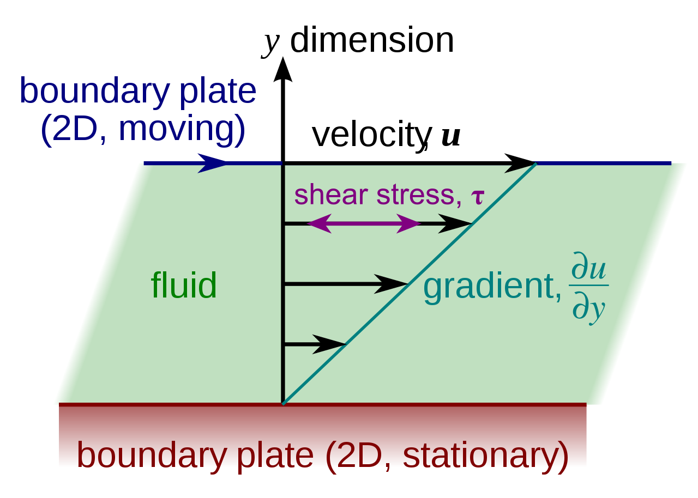
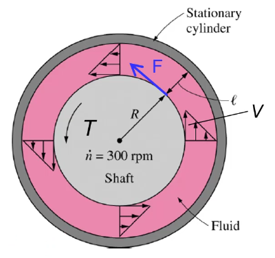

# Chapter 2

[TOC]

## Introduction

Any characteristic of a system is called a **property**

- intensive properties: independent of the mass of the system
- extensive properties: depend on the the size of the system

## 2-1 Density and Specific Gravity

### Definition

$$
\begin{aligned}
    \rho &= \frac{m}{V}\\[2ex]
    \text{SG} &= \frac{\rho}{\rho_{H_2O}}
\end{aligned}
$$

### Density of Ideal Gases

$$
PV = mRT
$$

## 2-2 Vapor Pressure and Cavitation

### Definition 

the collapse of cavities of vapor in a liquid

> is a violent process which can damage machinery and can cause structural vibrations

## 2-3 Compressibility

### Coefficient of Compressibility

$$
\kappa\approxeq-\frac{\Delta P}{\Delta v/v}\approxeq \frac{\Delta P}{\Delta \rho/\rho}
$$

and for ideal gas, we have

$$
\frac{\Delta P}{P} = \frac{\Delta \rho}{\rho}
$$

## 2-4 Viscosity

### Definition

A property that represents the internal resistance of a fluid to motion

$$
\tau = \mu \frac{\mathrm{d}u}{\mathrm{d}y}
$$

and the shear force acting on the fluid layer is

$$
F = \tau A =\mu A \frac{\mathrm{d}u}{\mathrm{d}y}=\mu A \frac{V}{l}
$$

where the upper plate is at a constant speed while the lower plate remains **stationary**

### Example - Cylindrical

**Find the torque**

$$
\begin{aligned}
    T &= F\cdot R\\[2ex]
      &= \mu A \frac{V}{l}\cdot R\\[2ex]
      &= \mu \cdot 2\pi R L\cdot \frac{2\pi \dot{n}\cdot R}{l}\cdot R\\[2ex]
      &= \mu \frac{4\pi^2R^3\dot{n}L}{l}
\end{aligned}
$$

## 2-5 Capillary Effect

### Definition

the rise of fall of a liquid in a small-diameter tube inserted into a liquid

$$
h = \frac{2\sigma_s}{\rho g R}\cos\phi
$$

