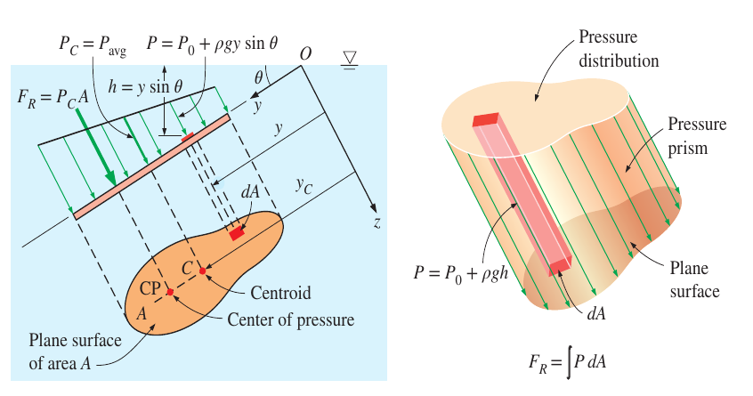
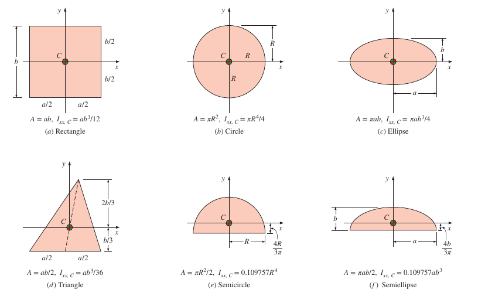
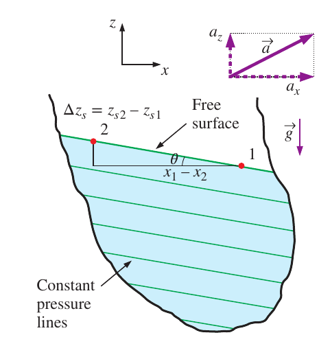
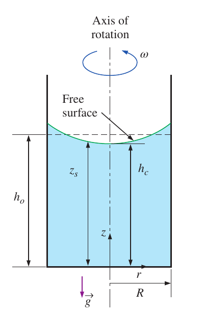

# CH-3

[TOC]

## 3-1 Pressure Measurement Devices

$$
\begin{aligned}
    P_{\text{gage}} &= P_{\text{abs}}-P_{\text{atm}}\\[2ex]
    P_{\text{vac}} &= P_{\text{atm}}-P_{\text{abs}}=-P_{\text{gage}}
\end{aligned}
$$

## 3-2 Hydrostatic Forces on Submerged Plane Surfaces

### Definition

On a plane surface, the hydrostatic forces form a system of parallel forces, and we often need to determine the *magnitude* of the force and its *points of location*, which is called **the center of the pressure**

$$
\begin{aligned}
    F_R &= \int{P\mathrm{d}A}\\[2ex]
        &= P_0A+\rho g \sin\theta\int{y\mathrm{d}A}\\[2ex]
    y_c &= \frac{1}{A}\int{y\mathrm{d}A}\\[2ex]
    I_{xx,O} &= \int{y^2\mathrm{d}A}= I_{xx,C}+y_C^2A
\end{aligned}
$$

and we ca get that

$$
\begin{aligned}
    F_R &= (P_0+\rho g y_c\sin\theta)A\\[2ex]
    y_PF_R &= \int{yP\mathrm{d}A}\\[2ex]
        &= P_0\int{y\mathrm{d}A}+\rho g \sin\theta\int{y^2\mathrm{d}A}\\[2ex]
        &= P_0 Ay_c+\rho g \sin\theta I_{xx,O}\\[2ex]
        &= P_0A y_c+\rho g \sin\theta (I_{xx,C}+y_C^2 A)\\[2ex]
    y_P &= y_C+\frac{I_{xx,C}}{[y_C+P_0/(\rho g \sin\theta)]A}
\end{aligned}
$$

if the atmosphere is ignored

$$
y_P = y_C+\frac{I_{xx,C}}{y_C A}
$$

## 3-3 Fluids in Rigid-Body Motion

### Acceleration on a Straight Path

$$
\text{Slope}=\frac{\mathrm{d}z}{\mathrm{d}x}=-\frac{a_x}{g+a_z}=-\tan\theta
$$

and the pressure distribution is expressed as

$$
P = P_0-\rho a_x x-\rho(g+a_z)z
$$

### Rotation in a Cylindrical Container

$$
z_s = \frac{\omega^2}{2g}r^2+h_C
$$

and the pressure is expressed as

$$
P = P_0+\frac{\rho \omega^2}{2}r^2-\rho g z
$$