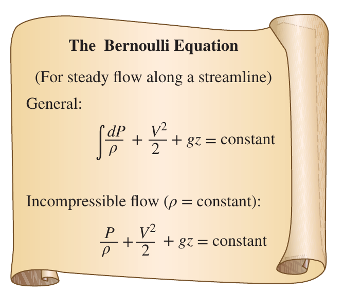

# Chapter 5

[TOC]

## 5-1 Conversion of Mass

- **Mass and Flow Rate**: $\dot{m}=\rho \dot{V}$
- **Mass Balance**: $\sum_{in}{\dot{m}}=\sum_{out}{\dot{m}}$
- **Incompressible Flow**: $\dot{V}_1=\dot{V}_2\Rightarrow v_1A_1 = v_2A_2$

## 5-2 The Bernoulli Equation

The **Bernoulli Equation** is an approximate relation between pressure, velocity, and elevation, and is valid in regions of steady, incompressible flow where net frictional forces are negligible

$$
\frac{P_1}{\rho}+\frac{V_1^2}{2}+gz_1=\frac{P_2}{\rho}+\frac{V_2^2}{2}+gz_2
$$

## 5-3 Energy Analysis of Steady Flows

$$
\dot{m}\Big(\frac{P_1}{\rho}+\alpha_1\frac{V_1^2}{2}+gz_1\Big)+\dot{W}_{\text{pump,u}}=\dot{m}\Big(\frac{P_2}{\rho}+\alpha_2\frac{V_2^2}{2}+gz_2\Big)+\dot{W}_{\text{turbine,e}}+E_{\text{mech,loss}}
$$

- $\alpha$: the kinetic energy correction factor
- $\dot{W}_{\text{pump},u}$: the useful energy that the pump delivered
- $\dot{W}_{\text{turbine},e}$: the energy used by turbine
- $E_{\text{mech,loss}}$: the mechanical energy that lost