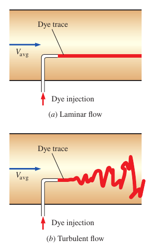
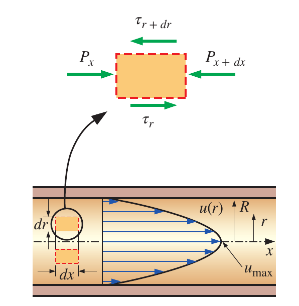
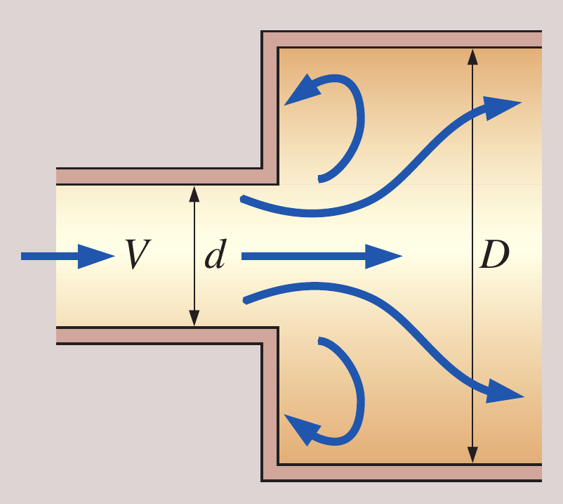

# Chapter 8

## 8-1 Laminar and Turbulent Flows

- **Laminar**: smooth streamlines and highly ordered motion
- **Turbulent**: velocity fluctuations and highly disordered motion

### Reynolds Number

the Reynolds number is expressed for internal flow in a circular pipe as

$$
Re = \frac{\rho V_{avg}D}{\mu}
$$

- $D$: diameter
- $\mu$: dynamic viscosity

and here's the classification

- $Re<2300$: laminar flow
- $Re\geq 4000$: turbulent flow

## 8-2 Laminar Flow in Pipes

the velocity profile in fully developed laminar flow in a pipe is **parabolic**

$$
u(r) = -\frac{R^2}{4\mu}\Big(\frac{\mathrm{d}P}{\mathrm{d}x}\Big)\Big(1-\frac{r^2}{R^2}\Big)
$$

- $R$: radius
- $\mu$: dynamic viscosity
- $\frac{\mathrm{d}P}{\mathrm{d}x}$: constant gradient of pressure on x direction

$$
u_{max} = 2\cdot V_{avg}
$$

the **average velocity** in fully developed **laminar pipe flow** is one half of the maximum velocity

### Pressure Drop and Head Loss

$$
\begin{aligned}
    \Delta P_L &= f\cdot \frac{L}{D}\cdot \frac{\rho V_{avg}^2}{2}\\[2ex]
    h_L &= \frac{\Delta P_L}{\rho g}
\end{aligned}
$$

- $f$: Darcy friction factor
- $L$: length
- $D$: diameter

the relation for the pressure loss is called Darcy-Weisbach-Equation and is one valid for **laminar** and **turbulent** flows, **circular** and **non-circular** pipes, and pipes with **smooth** or **rough** surfaces

## 8-3 Turbulent Flow in Pipes

the friction factor $f_{\text{turb}}$ in fully **developed turbulent pipe flow** depends on the *Reynolds number* and the *relative roughness* $\frac{\varepsilon}{D}$, which is the ratio of the mean **height of roughness** of the pipe to the pipe diameter

$$
f_{\text{turb}}=f\Big(\frac{\varepsilon}{D},Re\Big)
$$

and here's the explicit relation

$$
\frac{1}{\sqrt{f}}\approxeq -1.8\Big[\frac{6.9}{Re}+\Big(\frac{\varepsilon/D}{3.7}\Big)^{1.11}\Big]
$$

## 8-4 Minor Losses

The fluid in a typical piping system passes through various fittings, valves, bends and so on. These components interrupt the smooth flow of the fluid and cause additional losses. But these losses are minor compared to the head loss in the straight sections and are called **minor losses**

$$
K_L = \frac{h_L}{V^2/2g}
$$

- different for each component
- assumed to be independent of $Re$
- usually **given**

If the piping system has a constant pipe diameter $D$:

$$
\begin{aligned}
    h_{L,\text{total}} &= h_{L,\text{major}}+h_{L,\text{minor}}\\[2ex]
    h_{L,\text{total}} &= \sum_i{f_i\frac{L_i}{D_i}\frac{V_i^2}{2g}+\sum_j{K_{L,j}\frac{V_j^2}{2g}}}\\[2ex]
    &= \Big(f\frac{L}{D}+\sum_j{K_{L,j}}\Big)\frac{V^2}{2g}
\end{aligned}
$$

### Sudden Expansion

$$
K_L = \alpha\Big(1-\frac{d^2}{D^2}\Big)^2
$$

- free jet: $\lim_{D\to d}{K_L}=\alpha\lim_{D\to d}(1-d^2/D^2)=0$
- large reservoir: $\lim_{D\to \infty}{K_L}=\alpha\lim_{D\to \infty}(1-d^2/D^2)=\alpha$