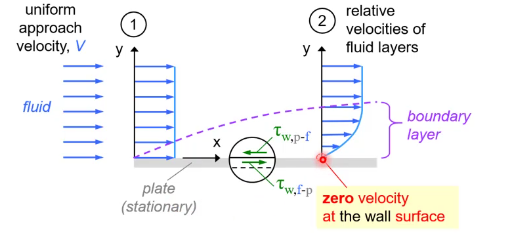
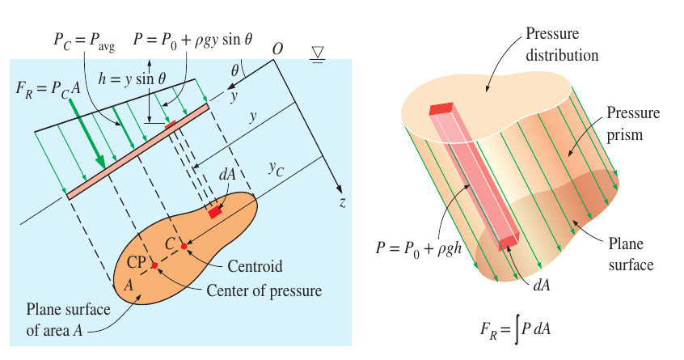
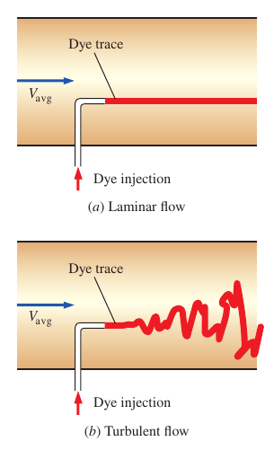
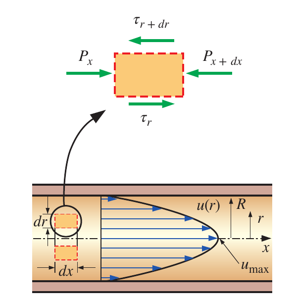

# Overview

[TOC]

## Chapter 1

### Introduction

#### Stress

**Stress** is defined as the force per unit area

##### Normal Stress

$$
\sigma = \frac{\mathrm{d}F_n}{\mathrm{d}A}
$$

> In a fluid at rest, the **normal stress** is called **pressure P**

##### Tangential Stress

$$
\tau = \frac{\mathrm{d}F_t}{\mathrm{d}A}
$$

#### Fluid

A substance in the **liquid** or **gas** phase is referred to as a **fluid**

> A fluid **deforms continuously** under the influence of a shear stress, no matter how small and approaches a certain rate of strain

### 1-1 The No-Slip Condition

#### Definition

A fluid in direct contact with a solid "sticks" to the surface due to viscous effects

> The fluid property responsible for the no-slip condition and the development of the boundary layer is **viscosity**

### 1-2 System and Control Volume

#### Definition

A **system** is defined as a quantity of matter or a region in space chosen for study

The mass or region outside the system is called the **surroundings**

The real or imaginary surface that separates the system from its surroundings is called the **boundary**

#### Classifications

- Closed System
    a system consists of a fixed amount of mass and no mass can cross its boundary
- Open System

a system where both mass and energy can cross the boundary of a control volume

## Chapter 2

### Introduction

Any characteristic of a system is called a **property**

- intensive properties: independent of the mass of the system
- extensive properties: depend on the the size of the system

### 2-1 Density and Specific Gravity

$$
\begin{aligned}
    \rho &= \frac{m}{V}\\[2ex]
    \text{SG} &= \frac{\rho}{\rho_{H_2O}}
\end{aligned}
$$

and we could find the density of the ideal gas by the following equation

$$
PV = mRT
$$

### 2-2 Vapor Pressure and Cavitation

the **collapse of cavities** of vapor in a liquid

- $P_{\text{local}}>P_v$: safe
- $P_{\text{local}}\leq P_v$: risk of cavitation

### 2-3 Viscosity

#### Definition

A property that represents the internal resistance of a fluid to motion

$$
\tau = \mu \frac{\mathrm{d}u}{\mathrm{d}y}
$$

and the shear force acting on the fluid layer is

$$
F = \tau A =\mu A \frac{\mathrm{d}u}{\mathrm{d}y}=\mu A \frac{V}{l}
$$

where the upper plate is at a constant speed while the lower plate remains **stationary**

#### Example - Cylindrical

**Find the torque**

$$
\begin{aligned}
    T &= F\cdot R\\[2ex]
      &= \mu A \frac{V}{l}\cdot R\\[2ex]
      &= \mu \cdot 2\pi R L\cdot \frac{2\pi \dot{n}\cdot R}{l}\cdot R\\[2ex]
      &= \mu \frac{4\pi^2R^3\dot{n}L}{l}
\end{aligned}
$$

## Chapter 3

### 3-1 Pressure Measurement Devices

$$
\begin{aligned}
    P_{\text{gage}} &= P_{\text{abs}}-P_{\text{atm}}\\[2ex]
    P_{\text{vac}} &= P_{\text{atm}}-P_{\text{abs}}=-P_{\text{gage}}
\end{aligned}
$$

### 3-2 Hydrostatic Forces on Submerged Plane Surfaces

On a plane surface, the hydrostatic forces form a system of parallel forces, and we often need to determine the *magnitude* of the force and its *points of location*, which is called **the center of the pressure**

$$
\begin{aligned}
    F_R &= \int{P\mathrm{d}A}\\[2ex]
        &= P_0A+\rho g \sin\theta\int{y\mathrm{d}A}\\[2ex]
    y_c &= \frac{1}{A}\int{y\mathrm{d}A}\\[2ex]
    I_{xx,O} &= \int{y^2\mathrm{d}A}= I_{xx,C}+y_C^2A
\end{aligned}
$$

and we ca get that

$$
\begin{aligned}
    F_R &= (P_0+\rho g y_c\sin\theta)A\\[2ex]
    y_PF_R &= \int{yP\mathrm{d}A}\\[2ex]
        &= P_0\int{y\mathrm{d}A}+\rho g \sin\theta\int{y^2\mathrm{d}A}\\[2ex]
        &= P_0 Ay_c+\rho g \sin\theta I_{xx,O}\\[2ex]
        &= P_0A y_c+\rho g \sin\theta (I_{xx,C}+y_C^2 A)\\[2ex]
    y_P &= y_C+\frac{I_{xx,C}}{[y_C+P_0/(\rho g \sin\theta)]A}
\end{aligned}
$$

if the atmosphere is ignored

$$
y_P = y_C+\frac{I_{xx,C}}{y_C A}
$$

### 3-3 Fluids in Rigid-Body Motion

#### Acceleration on a Straight Path

$$
\text{Slope}=\frac{\mathrm{d}z}{\mathrm{d}x}=-\frac{a_x}{g+a_z}=-\tan\theta
$$

and the pressure distribution is expressed as

$$
P = P_0-\rho a_x x-\rho(g+a_z)z
$$

#### Rotation in a Cylindrical Container

$$
z_s = \frac{\omega^2}{2g}r^2+h_C
$$

and the pressure is expressed as

$$
P = P_0+\frac{\rho \omega^2}{2}r^2-\rho g z
$$

## Chapter 4

### 4-1 Eulerian Description

- Pressure Field: $P=P(x,y,z,t)$
- Velocity Field: $\vec{V}=\vec{V}(x,y,z,t)$
- Acceleration Field: $\vec{a}=\vec{a}(x,y,z,t)$

where the rate of change of the particle's x-position with respect to time is $u$ and similar to y($v$) and z($w$)

$$
\vec{a}(x,y,z,t) = \frac{\partial{\vec{V}}}{\partial{t}}+u\frac{\partial{\vec{V}}}{\partial{x}}+v\frac{\partial{\vec{V}}}{\partial{y}}+w\frac{\partial{\vec{V}}}{\partial{z}}
$$

and in Cartesian coordinates, we could get that

$$
\begin{cases}
    a_x = \frac{\partial{u}}{\partial{t}}+u\frac{\partial{u}}{\partial{x}}+v\frac{\partial{u}}{\partial{y}}+w\frac{\partial{u}}{\partial{z}}\\[2ex]
    a_y = \frac{\partial{v}}{\partial{t}}+u\frac{\partial{v}}{\partial{x}}+v\frac{\partial{v}}{\partial{y}}+w\frac{\partial{v}}{\partial{z}}\\[2ex]
    a_x = \frac{\partial{w}}{\partial{t}}+u\frac{\partial{w}}{\partial{x}}+v\frac{\partial{w}}{\partial{y}}+w\frac{\partial{w}}{\partial{z}}
\end{cases}
$$

## Chapter 5

### 5-1 Conversion of Mass

- **Mass and Flow Rate**: $\dot{m}=\rho \dot{V}$
- **Mass Balance**: $\sum_{in}{\dot{m}}=\sum_{out}{\dot{m}}$
- **Incompressible Flow**: $\dot{V}_1=\dot{V}_2\Rightarrow v_1A_1 = v_2A_2$

### 5-2 The Bernoulli Equation

The **Bernoulli Equation** is an approximate relation between pressure, velocity, and elevation, and is valid in regions of steady, incompressible flow where net frictional forces are negligible

$$
\frac{P_1}{\rho}+\frac{V_1^2}{2}+gz_1=\frac{P_2}{\rho}+\frac{V_2^2}{2}+gz_2
$$

### 5-3 Energy Analysis of Steady Flows

$$
\frac{P_1}{\rho g}+\alpha_1\frac{V_1^2}{2g}+z_1+h_{\text{pump},u}=\frac{P_2}{\rho g}+\alpha_2\frac{V_2^2}{2g}+z_2+h_{\text{turbine},e}+h_L
$$

- $\alpha$: the kinetic energy correction factor
- $h_{\text{pump},u}$: the useful head delivered
- $h_{\text{turbine},e}$: the extracted head removed from the fluid by the turbine
- $h_L$: irreversible head loss

## Chapter 6

### 6-1 The Linear Momentum Equation

$$
\sum{\vec{F}}=\sum_{\text{out}}{\beta \dot{m}\vec{V}}-\sum_{\text{in}}{\beta \dot{m}\vec{V}}
$$

in the scalar form

$$
\begin{cases}
   \sum{F_x} = \dot{m}(\beta_2\cdot V_{2,x}-\beta_1\cdot V_{1,x})\\[2ex]
   \sum{F_z} = \dot{m}(\beta_2\cdot V_{2,z}-\beta_1\cdot V_{1,z})
\end{cases}
$$

where $F_x$ and $F_z$ is the net force of the **reaction**, **pressure** and **body** force

## Chapter 8

### 8-1 Laminar and Turbulent Flows

- **Laminar**: smooth streamlines and highly ordered motion
- **Turbulent**: velocity fluctuations and highly disordered motion

#### Reynolds Number

the Reynolds number is expressed for internal flow in a circular pipe as

$$
Re = \frac{\rho V_{avg}D}{\mu}
$$

- $D$: diameter
- $\mu$: dynamic viscosity

and here's the classification

- $Re<2300$: laminar flow
- $Re\geq 4000$: turbulent flow

### 8-2 Laminar Flow in Pipes

the velocity profile in fully developed laminar flow in a pipe is **parabolic**

$$
u(r) = -\frac{R^2}{4\mu}\Big(\frac{\mathrm{d}P}{\mathrm{d}x}\Big)\Big(1-\frac{r^2}{R^2}\Big)
$$

- $R$: radius
- $\mu$: dynamic viscosity
- $\frac{\mathrm{d}P}{\mathrm{d}x}$: constant gradient of pressure on x direction

$$
u_{max} = 2\cdot V_{avg}
$$

the **average velocity** in fully developed **laminar pipe flow** is one half of the maximum velocity

#### Pressure Drop and Head Loss

$$
\begin{aligned}
    \Delta P_L &= f\cdot \frac{L}{D}\cdot \frac{\rho V_{avg}^2}{2}\\[2ex]
    h_L &= \frac{\Delta P_L}{\rho g}
\end{aligned}
$$

- $f$: Darcy friction factor
- $L$: length
- $D$: diameter

the relation for the pressure loss is called Darcy-Weisbach-Equation and is one valid for **laminar** and **turbulent** flows, **circular** and **non-circular** pipes, and pipes with **smooth** or **rough** surfaces

### 8-3 Turbulent Flow in Pipes

the friction factor $f_{\text{turb}}$ in fully **developed turbulent pipe flow** depends on the *Reynolds number* and the *relative roughness* $\frac{\varepsilon}{D}$, which is the ratio of the mean **height of roughness** of the pipe to the pipe diameter

$$
f_{\text{turb}}=f\Big(\frac{\varepsilon}{D},Re\Big)
$$

and here's the explicit relation

$$
\frac{1}{\sqrt{f}}\approxeq -1.8\Big[\frac{6.9}{Re}+\Big(\frac{\varepsilon/D}{3.7}\Big)^{1.11}\Big]
$$

### 8-4 Minor Losses

The fluid in a typical piping system passes through various fittings, valves, bends and so on. These components interrupt the smooth flow of the fluid and cause additional losses. But these losses are minor compared to the head loss in the straight sections and are called **minor losses**

$$
K_L = \frac{h_L}{V^2/2g}
$$

- different for each component
- assumed to be independent of $Re$
- usually **given**

If the piping system has a constant pipe diameter $D$:

$$
\begin{aligned}
    h_{L,\text{total}} &= h_{L,\text{major}}+h_{L,\text{minor}}\\[2ex]
    h_{L,\text{total}} &= \sum_i{f_i\frac{L_i}{D_i}\frac{V_i^2}{2g}+\sum_j{K_{L,j}\frac{V_j^2}{2g}}}\\[2ex]
    &= \Big(f\frac{L}{D}+\sum_j{K_{L,j}}\Big)\frac{V^2}{2g}
\end{aligned}
$$

#### Sudden Expansion

$$
K_L = \alpha\Big(1-\frac{d^2}{D^2}\Big)^2
$$

- free jet: $\lim_{D\to d}{K_L}=\alpha\lim_{D\to d}(1-d^2/D^2)=0$
- large reservoir: $\lim_{D\to \infty}{K_L}=\alpha\lim_{D\to \infty}(1-d^2/D^2)=\alpha$